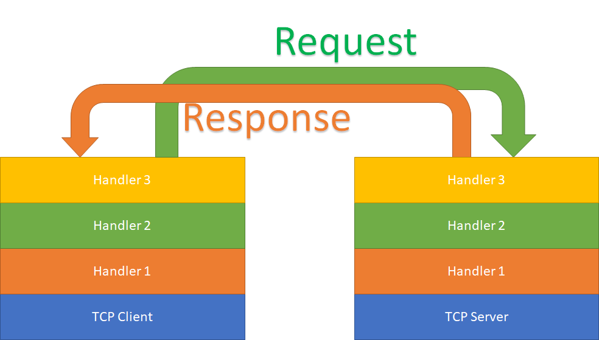
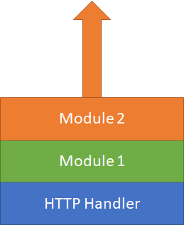
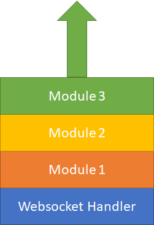

# MTSC - Modular TCP Server and Client
Build TCP servers out of modules with handlers for communication, exception and logging.
## Nuget
https://www.nuget.org/packages/MTSC/
## Examples
Functional Examples are provided in the TestClient and TestServer projects.
# Brief description

## Main Idea
The main idea is the implemention of a modular solution so as to be able to add functionality to tcp communication by simply adding handlers.
## Overview of functionality
As observed in the above schematic, a message leaving the client/server follows a pattern before actually being sent. 

When a message is being sent, the information is first processed by the added handlers, in the order they were added. 
When a message is being received, the information is processed by the added handlers, in reverse of the order they were added.

If a handler decides that it wants to preserve the message or not allow other handlers to process the message, it can return true for the current operation, signifying that the message has been handled and no further handlers should process it.

Refer to the wiki for implementation specific details.
## HTTP Handler functionality
MTSC features an implemented handler for HTTP messages.

The main idea of operation is similar to handlers. The HTTP handler receives and parses the message and then the modules receive the requset and response structures, being given the opportunity to modify them.

Similarly to the handlers the HTTP modules can return true to signal that the message has been processed and that no other subsequent module should process current message.

The order in which they get to process a message is the same order as they were added into the list of modules.

## Websocket Handler functionality
MTSC features an implemented handler for Websocket communication.

Similar to the HTTP handler, the Websocket handler features modules to extend functionality. After the handler finishes the websocket handshake, the communication will be passed through the modules in the order they were added into the list of modules.

## Exception handlers
MTSC allows users to define exception handlers that can be added onto the client and server sockets, in order to provide functionality to exception handling.

## Loggers
MTSC allows users to create and define loggers that can be added onto the client and server sockets, in order to provide logging functionality.

# Remarks
As all the communication is done through the same TCP socket, this library allows the creation of complex webservers capable of multiple communication protocols and a wide array of functionality.

The tcp server procedure features scaling algorithms that allow the server to lower the CPU usage during period of inactivity and to only use full CPU when handling a large load of requests.

The tcp server procedre also features the ability to set a fixed tick rate, depending on the need of the user.

## HTTP Benchmarks
The HTTP handler has been benchmarked against 1000 concurrent connections and provided a 200 status code and a hello world page to up to 50k requests/sec, averaging around 18k req/s at maximum load. The solution has been tested on an Intel Core i7 clocked at 2.5GHz.
